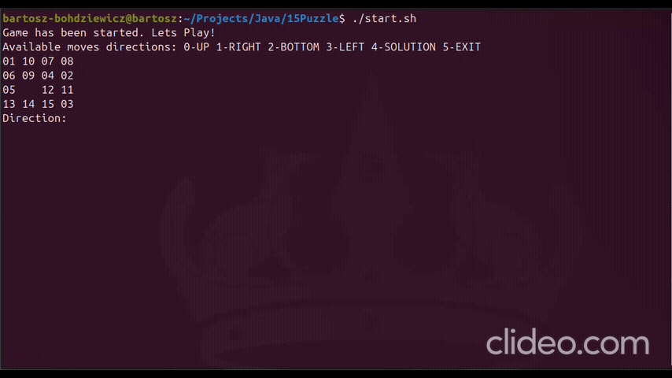

# 15 Puzzle (Java)

Classic 15‑puzzle game written in Java. The goal is to arrange the tiles in ascending order with the empty space in the bottom‑right corner. 

## Context & Technical Focus
This repository serves as an academic Proof-of-Concept (PoC) project. It was developed primarily to explore Object-Oriented Programming (OOP) principles in a strongly-typed enterprise language (Java) and to implement advanced state-space search algorithms. 
While it represents an earlier stage of my programming journey, it demonstrates a solid foundation in applying theoretical computer science concepts to practical problems.

## Demo 

You can see result of the solver inside [demo/result.txt](./demo/result.txt).

## Features
- Random, solvable 4x4 board generation
- Console gameplay with simple numeric controls
- Automatic solver based on graph traversal and heuristics

## Requirements
- JDK installed (so javac and java are available in your PATH)

## Run
Option A (Linux/macOS):
./start.sh

Option B (any OS with JDK):
javac Main.java
java Main

## Controls
At runtime you will see:
Available moves directions: 0-UP 1-RIGHT 2-BOTTOM 3-LEFT 4-SOLUTION 5-EXIT

Enter the number and press Enter:
- 0 – move empty tile up
- 1 – move empty tile right
- 2 – move empty tile down
- 3 – move empty tile left
- 4 – run the automatic solver
- 5 – exit

## Automatic Solver (Algorithmic Approach)
The core of the solver relies on the A* (A-Star) search algorithm combined with the Manhattan distance heuristic. 
- It efficiently navigates the massive state space of the 15-puzzle by exploring states in order of the lowest estimated total cost (f = g + h).
- This implementation showcases an understanding of tree/graph traversal, memory management for tracking visited nodes, and algorithmic optimization in Java.